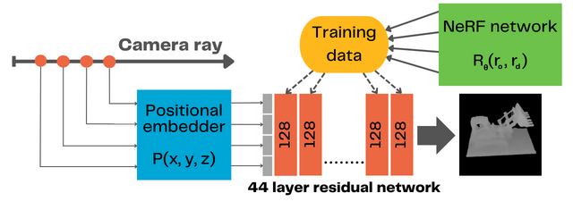
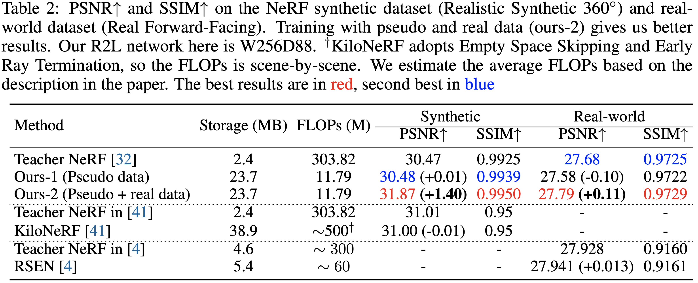
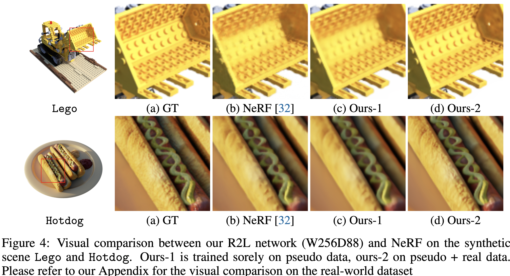

# Depth Light Field Training (DeLFT)

### [Project](https://mihneatoader.github.io/Depth-Light-Field-Training) | [Paper](https://github.com/MihneaToader/Depth-Light-Field-Training)

> **[Depth Light Field Training (DeLFT)](https://mihneatoader.github.io/Depth-Light-Field-Training)** \
> [Mihnea Toader](http://mihneatoader.github.io/)<sup>1</sup> \
> Supervisors: Elmar Eisemann<sup>1</sup>, Petr Kellnhofer<sup>1</sup>, Michael Weinmann<sup>1</sup>\
> <sup>1</sup> EEMCS, Delft University of Technology, The Netherlands \

**Description:** We present DeLFT, a neural model that tackles the issue of shadow generation by using a deep residual MLP network with fast evaluation times, that generates view-dependent shadow maps. The network distills the knowledge of an existing NeRF model and achieves the speedup through the use of neural light fields, by only doing one network forward per ray.

This is a thesis submitted to EEMCS Faculty Delft University of Technology, in partial fulfilment of the requirements for the [Bachelor of Computer Science and Engineering](https://github.com/TU-Delft-CSE), for the [Research Project](https://github.com/TU-Delft-CSE/Research-Project) course.

<div align="center">
    <a></a>
</div>


## Running DeLFT
The following instructions show how to run/train a DeLFT model on the `lego` scene.
As prerequisites, we recommend using WSL 2.0 with Ubuntu 22.04 (both available on the Windows Store app) to setup the environment.
Conda must also be installed. Additionally, a GPU with a minimum of 4GB VRAM is recommended.

### 0. Download the code
```
git clone git@github.com:MihneaToader/Depth-Light-Field-Training.git && cd Depth-Light-Field-Training
```


### 1. Set up (original) data
```bash
sh scripts/download_example_data.sh
```

### 2. Set up environment with Anaconda
- `conda create --name DeLFT python=3.9.6`
- `conda activate DeLFT`
- `pip install -r requirements.txt`

### 3. Quick start: test our trained models
- Download models:
```
sh scripts/download_DeLFT_models.sh
```

- Run
```bash
CUDA_VISIBLE_DEVICES=0 python main.py --model_name DeLFT --config configs/lego_noview.txt --n_sample_per_ray 16 --netwidth 128 --netdepth 44 --use_residual --cache_ignore data --trial.ON --trial.body_arch resmlp --pretrained_ckpt DeLFT_Blender_Models/lego.tar --render_only --render_test --testskip 1 --screen --train_depth --project Test__DeLFT_W128D44__blender_lego
```  
If out of memory errors are being thrown, add `--chunk 10000 --netchunk 20000` and change the values until running properly.
 
### 4. Train DeLFT models

#### Step 1. 
Download NeRF teacher:
```bash
sh scripts/download_NeRF_models.sh
```

#### Step 2. 
Use the pretrained NeRF model to generate synthetic depth data:
```bash
CUDA_VISIBLE_DEVICES=0 python utils/create_data.py --create_data rand --config configs/lego.txt --teacher_ckpt NeRF_Blender_Models/lego.tar --n_pose_kd 1000 --datadir_kd data/nerf_synthetic/lego:data/nerf_synthetic/lego_depth1k --screen --cache_ignore data,__pycache__,torchsearchsorted,imgs --project NeRF__synthetic_lego__create_pseudo --save_depth
```
Again, if OOM errors are being thrown, change the `--chunk` and `--netchunk` arguments.

Otherwise, download our already generated 1k set:
```bash
sh scripts/download_lego_depth1k.sh
```
The data will be extracted under `data/nerf_synthetic/lego_depth_1k`.

#### Step 3.
Train DeLFT model on the synthetic depth data:
```bash
CUDA_VISIBLE_DEVICES=0 python main.py --model_name DeLFT --config configs/lego_noview.txt --n_sample_per_ray 16 --netwidth 128 --netdepth 44 --datadir_kd data/nerf_synthetic/lego_depth1k --n_pose_video 20,1,1 --N_iters 100000 --N_rand 6 --data_mode rays --hard_ratio 0.2 --hard_mul 20 --use_residual --trial.ON --trial.body_arch resmlp --num_worker 8 --warmup_lr 0.0001,200 --cache_ignore data,__pycache__,torchsearchsorted,imgs --screen --project DeLFT__blender_lego --train_depth --i_testset 1000
```
If OOM errors are being thrown, change the `--N_rand` argument.

If you are using the downloaded `lego_depth_1k` data, change the `datadir_kd` option to the location of the folder

## Other scenes
If you wish to train other scenes, download the scene data from [here](https://drive.google.com/drive/folders/128yBriW1IG_3NJ5Rp7APSTZsJqdJdfc1) and place the data in either `data/nerf_llff_data` or `data/nerf_synthetic`. 
Corresponding synthetic NeRF teacher checkpoints should be available under the `NeRF_Blender_Models` directory.
For LLFF scenes, download the NeRF teacher checkpoints from [here](https://drive.google.com/drive/folders/1jIr8dkvefrQmv737fFm2isiT6tqpbTbv).

## Results
See more results and videos on our [webpage](https://mihneatoader.github.io/Depth-Light-Field-Training).
<div align="center">
    <a></a><br>
    <a></a>
</div>


## Acknowledgments
This project relies heavily on the structure put in place by [R2L](https://github.com/snap-research/R2L). The timeline
of the research project would have been unfeasible if not for their great and comprehensive implementation.


